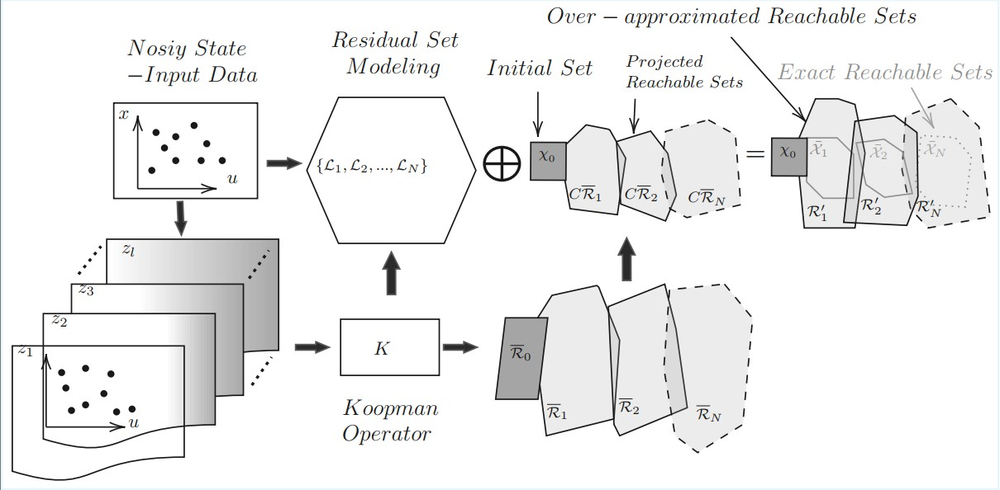

## Data-Driven Reachability of Nonlinear Lipschitz Systems via Koopman Operator Embeddings
<br/> 
This repo contains the code for the following paper :<br/> 
1- Naderi Akhormeh, Alireza and Fawzy, Abdulla and Hafez, Ahmad  and Alanwar, Amr. "Data-Driven Reachability of Nonlinear Lipschitz Systems via Koopman Operator Embeddings".

## A Short video about the idea
 
[](https://www.youtube.com/watch?v=y6rD7-fikPc)

## Problem Statement
This repository presents a data-driven framework for safety verification of robotic systems using zonotopic reachability analysis. While traditional zonotopic methods are scalable and efficient, they often become overly conservative when applied to nonlinear systems, especially over long prediction horizons and in the presence of measurement noise. To address this, we leverage the Koopman operator to lift nonlinear dynamics into a finite-dimensional linear representation that depends on both state and input. Reachable sets are computed in this lifted space using zonotopes and then projected back to the original state space, yielding guaranteed over-approximations of the true system behavior. The proposed approach significantly reduces conservatism while preserving formal safety guarantees. We provide theoretical results proving over-approximation of reachable sets, along with numerical simulations and real-world experiments on an autonomous vehicle, demonstrating tighter bounds compared to both model-based and linear data-driven methods.<br />

The following figure summarizes the idea behind our papers.
<br /> <br />
<p align="center">

</p>
## Running 
1- Download [CORA 2025](https://tumcps.github.io/CORA//pages/archive/v2025/index.html).<br />
2- Add CORA and subfolders to the Matlab path.  <br />
3. Add this repository and all its subfolders to the MATLAB path, **except** the `AddToCora2025` folder.  

4. Copy the following files from the `AddToCora2025` folder:
   - `reach_Koopman.m`
   - `reach_LS.m`
   - `linReach_Koopman.m`  

   into the following directory in CORA v2025: CORA_2025/cora/contDynamics/@nonlinearSysDT
<br />
<br />
## In Examples folder:<br />
1- run Reachability_Koopman_cstrDisc.m  for the example 1 in the paper (Affine Lipschitz dynamic system).<br />
2- run DD_Reachability_Koopman.m for yhe example 2 in the paper (Non-affine Lipschitz dynamic system).<br />
<br />
<br />
Our paper's BibTeX is as follows:

```bibtex
@article{naderi2026online,
  title     = {Data-Driven Reachability of Nonlinear Lipschitz Systems via Koopman Operator Embeddings},
  author    = {Naderi Akhormeh, Alireza and Fawzy, Abdulla and Hafez, Ahmad and Alanwar, Amr},
  journal   = {To be filled},
  year      = {2026},
  volume    = {},
  number    = {},
  pages     = {},
  publisher = {}
}